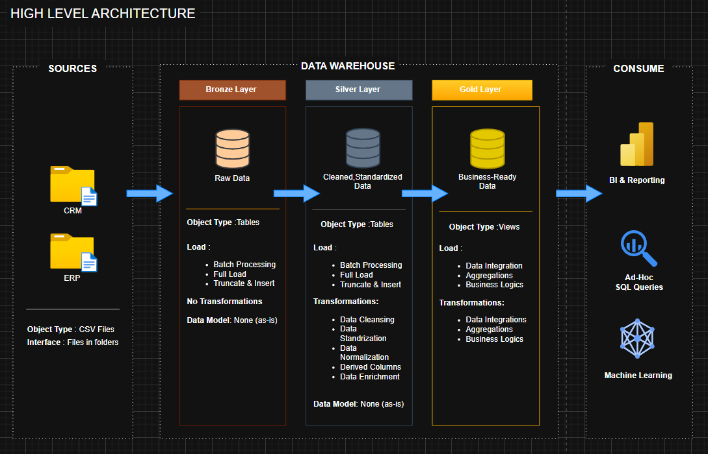

# Data Warehouse Project

Welcome to the **Data Warehouse Project** repository! 🚀  
This project demonstrates a comprehensive data warehousing and analytics solution, from building a data warehouse to generating actionable insights.

---
## 🏗️ Data Architecture

The data architecture for this project follows Medallion Architecture **Bronze**, **Silver**, and **Gold** layers:

1. **Bronze Layer**: Stores raw data as-is from the source systems. Data is ingested from CSV Files into SQL Server Database.
2. **Silver Layer**: This layer includes data cleansing, standardization, and normalization processes to prepare data for analysis.
3. **Gold Layer**: Houses business-ready data modeled into a star schema required for reporting and analytics.

---
## 📖 Project Overview

This project involves:

1. **Data Architecture**: Designing a Modern Data Warehouse Using Medallion Architecture **Bronze**, **Silver**, and **Gold** layers.
2. **ETL Pipelines**: Extracting, transforming, and loading data from source systems into the warehouse.
3. **Data Modeling**: Developing fact and dimension tables optimized for analytical queries.
4. **Analytics & Reporting**: Creating SQL-based reports and dashboards for actionable insights.

---

## 🚀 Project Requirements

### Building the Data Warehouse

#### Objective
Develop a modern data warehouse using SQL Server to consolidate sales data, enabling analytical reporting and informed decision-making.

#### Specifications
- **Data Sources**: Import data from two source systems (ERP and CRM) provided as CSV files.
- **Data Quality**: Cleanse and resolve data quality issues prior to analysis.
- **Integration**: Combine both sources into a single, user-friendly data model designed for analytical queries.
- **Scope**: Focus on the latest dataset only; historization of data is not required.
- **Documentation**: Provide clear documentation of the data model to support both business stakeholders and analytics teams.

---

### BI: Analytics & Reporting (Data Analysis)

#### Objective
Develop SQL-based analytics to deliver detailed insights into:
- **Customer Behavior**
- **Product Performance**
- **Sales Trends**

These insights empower stakeholders with key business metrics, enabling strategic decision-making.  

---

## 🌟 About Me

## 👋 Hi, I'm Lakshay Baneja  

I'm an aspiring **Data Analyst** passionate about exploring data and uncovering meaningful insights.  
Currently, I’m building my foundation in **SQL**, **Power BI**, **Excel**, and **Python** while working on projects that strengthen my analytical and visualization skills.  

---

### 💼 About Me  
- 🌱 Learning **data analysis**, **visualization**, and **reporting**  
- 🧠 Interested in **business intelligence** and **data storytelling**  
- 🎯 Goal: To apply analytical skills to real-world business problems  
- 📍 Based in India  

---

### 🛠️ Tech Stack  
**Languages & Tools:**  
`SQL` • `Python` • `Excel` • `Power BI`

---

### 🤝 Connect With Me  
  

---

### ✨ Fun Fact  
I believe that every dataset has a story — you just need the right tools to tell it.

    
